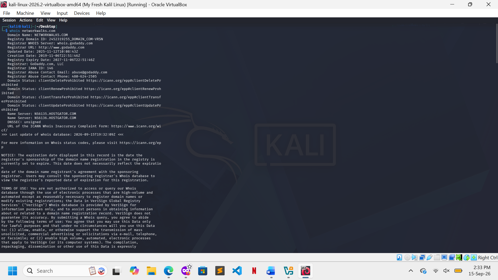
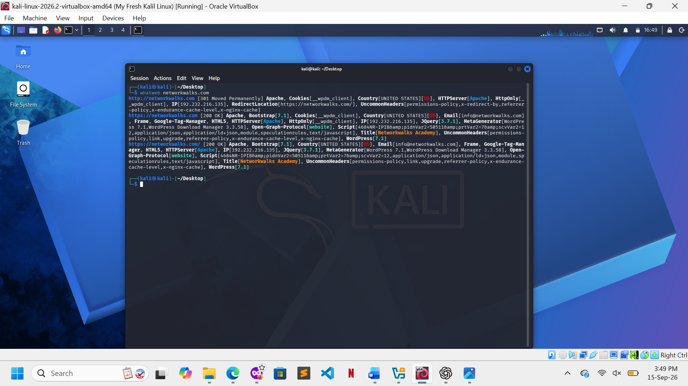
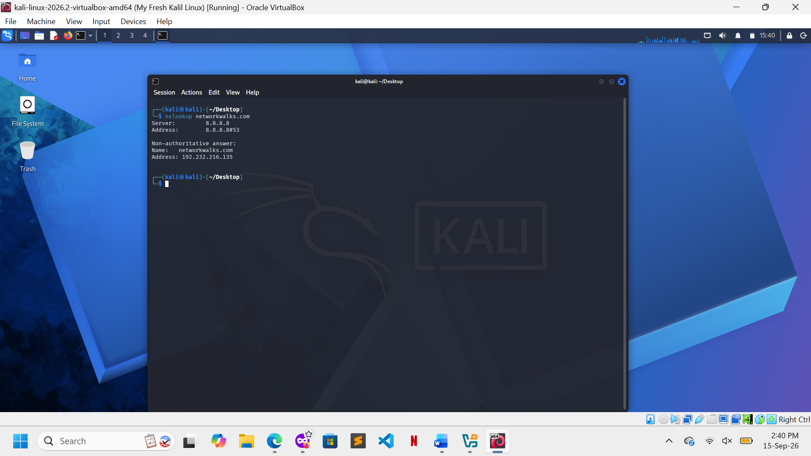
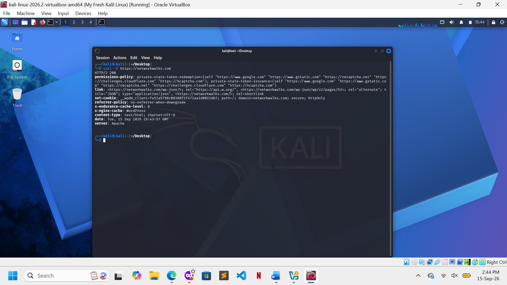
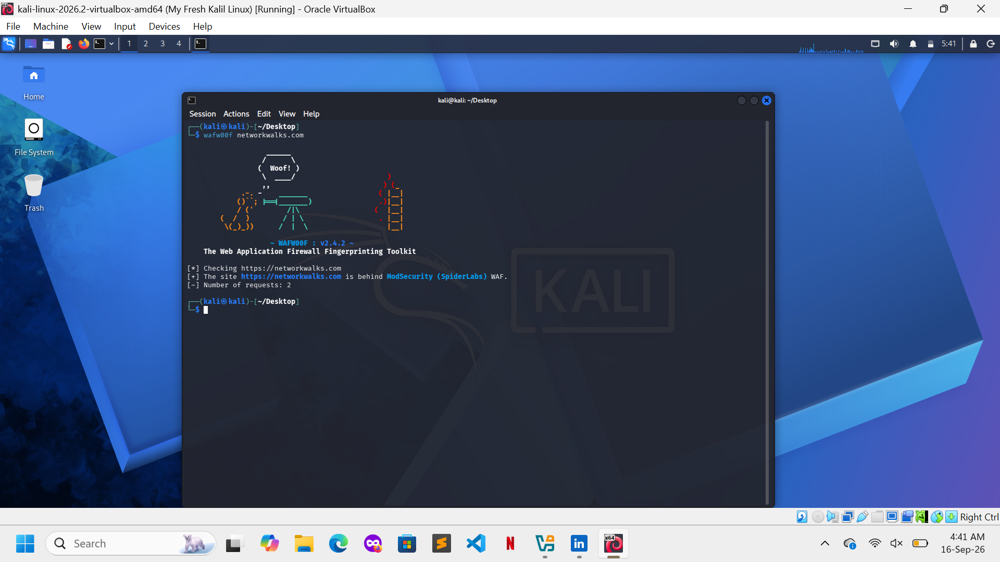
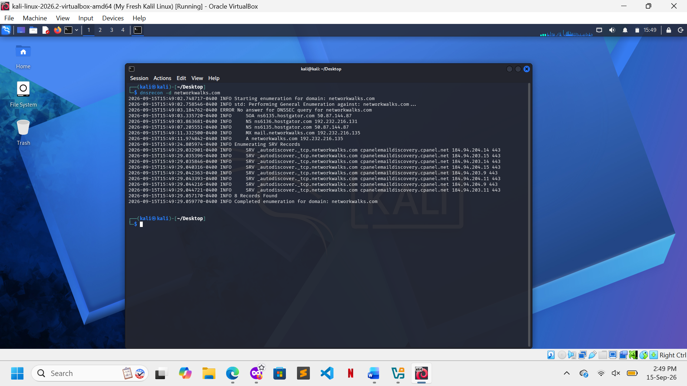

# FOOTPRINTING-RECONNAISSANCE-ATTACKS-WITH-MULTIPLE-KALI-TOOLS
The Repo is about Footprinting the live website networkwaks.com using the built-in Kali Linux tools which is whois, whatweb, nslookup, curl, wafw00f, and dnsrecon.  
# External Reconnaissance & Footprinting Assessment

## 1. Executive Summary

This assessment presents a practical reconnaissance exercise performed in a controlled Kali Linux laboratory environment. The objective was to examine the type of information that can be obtained from an authorized web target through publicly accessible services.

The assessment focused on six primary areas:

* Domain registration information
* Web application technology identification
* DNS resolution
* HTTP response analysis
* Web Application Firewall detection
* DNS record enumeration

Six command-line tools were used throughout the assessment:

**WHOIS | WhatWeb | Nslookup | Curl | Wafw00f | Dnsrecon**

The exercise demonstrates how individual pieces of publicly available information can be combined to create an initial technical profile of a target.

---

## 2. Assessment Scope

### Environment

| Parameter        | Description                           |
| ---------------- | ------------------------------------- |
| Operating System | Kali Linux                            |
| Assessment Type  | External reconnaissance               |
| Target           | Authorized training/laboratory domain |
| Method           | Command-line reconnaissance           |
| Purpose          | Cybersecurity education               |
| Authorization    | Controlled laboratory environment     |


---

## 3. Assessment Objectives

The assessment was designed to answer the following questions:

### Domain

What registration and ownership information is publicly available?

### Web Application

What technologies and platforms are exposed by the target website?

### Network

What IP addresses and DNS infrastructure are associated with the domain?

### HTTP

What information is disclosed through HTTP response headers?

### Defensive Controls

Is a Web Application Firewall detectable?

### DNS

What publicly accessible DNS records can be identified?

---

# 4. Reconnaissance Process

The investigation followed a progressive information-gathering approach.

```text
                         AUTHORIZED TARGET
                                │
                                ▼
                    ┌─────────────────────┐
                    │  1. DOMAIN ANALYSIS  │
                    │       WHOIS          │
                    └──────────┬──────────┘
                               │
                               ▼
                    ┌─────────────────────┐
                    │ 2. WEB FINGERPRINT  │
                    │      WHATWEB        │
                    └──────────┬──────────┘
                               │
                               ▼
                    ┌─────────────────────┐
                    │   3. DNS ANALYSIS   │
                    │      NSLOOKUP       │
                    └──────────┬──────────┘
                               │
                               ▼
                    ┌─────────────────────┐
                    │  4. HTTP ANALYSIS   │
                    │       CURL         │
                    └──────────┬──────────┘
                               │
                               ▼
                    ┌─────────────────────┐
                    │  5. WAF DETECTION   │
                    │      WAFW00F        │
                    └──────────┬──────────┘
                               │
                               ▼
                    ┌─────────────────────┐
                    │  6. DNS ENUMERATION │
                    │      DNSRECON       │
                    └──────────┬──────────┘
                               │
                               ▼
                    ┌─────────────────────┐
                    │ RECONNAISSANCE      │
                    │      PROFILE        │
                    └─────────────────────┘
```

---

#  Phase One — Domain Intelligence

## Tool: WHOIS

### Purpose

The first phase focused on obtaining publicly available registration information associated with the target domain.

### Command Used

```bash
whois example.com
```

### Information of Interest

The investigation looked for:

* Registrar information
* Domain creation date
* Domain expiration date
* Domain status
* Name servers
* Public administrative information
* Public technical information

`

---

# Phase Two — Web Technology Identification

## Tool: WhatWeb

### Purpose

WhatWeb was used to identify technologies exposed by the target's web application.

### Command Used

```bash
whatweb https://example.com
```

### Areas Examined

The output was reviewed for evidence of:

* Web server software
* Content Management Systems
* JavaScript frameworks
* Web frameworks
* Plugins
* Software versions
* Cookies
* Other identifiable technologies


### Security Relevance

Technology fingerprinting can help security professionals understand the target's externally visible technology stack and identify information that may require further defensive review.



---

# Phase Three — DNS Resolution

## Tool: Nslookup

### Purpose

The next phase examined the relationship between the target domain and its DNS infrastructure.

### Command Used

```bash
nslookup example.com
```

### Information Examined

The investigation looked for:

* Resolved IP address
* DNS server
* Address records
* Other available resolution information

### Result

**Resolved Address:**
`192.232.216.135

**DNS Server:**
`8.8.8.8



``

---

# Phase Four — HTTP Response Analysis

## Tool: Curl

### Purpose

Curl was used to inspect the HTTP response returned by the target.

### Command Used

```bash
curl -I https://example.com
```

### Information Examined

Particular attention was given to:

* HTTP status code
* Server header
* Redirect behaviour
* Cookie information
* Cache directives
* Security headers
* Other publicly disclosed configuration information

### Security Relevance

HTTP headers can provide useful information about how a web application is configured and what security controls are exposed to external users.

### Evidence



---

# Phase Five — Defensive Technology Identification

## Tool: Wafw00f

### Purpose

Wafw00f was used to determine whether the target appeared to be protected by a Web Application Firewall.

### Command Used

```bash
wafw00f https://example.com
```

### Assessment

The tool's output was examined to determine whether:

1. A WAF was detected.
2. A specific WAF technology could be identified.
3. No identifiable WAF was detected.
   

---

#  Phase Six — DNS Record Enumeration

## Tool: Dnsrecon

### Purpose

The final reconnaissance phase examined publicly accessible DNS records.

### Command Used

```bash
dnsrecon -d example.com
```

### Records Examined

The assessment looked for:

* A records
* AAAA records
* Name servers
* Mail exchange records
* TXT records
* SPF information
* SRV records
* Other publicly accessible DNS data

### Security Relevance

DNS records can provide useful information about an organization's publicly exposed infrastructure. Reviewing these records can help defenders identify unnecessary or unexpected external exposure.

### Evidence

`

---

# 5 Consolidated Findings

The information collected during the assessment can be summarized as follows:

| Assessment Area     | Tool     | Primary Finding    |
| ------------------- | -------- | ------------------ |
| Domain registration | WHOIS    | Networkwalks|
| Web technologies    | WhatWeb  | Web server: Apache` |
| IP resolution       | Nslookup | 192.232.216.135 |
| HTTP configuration  | Curl     | `[Insert finding]` |
| WAF protection      | Wafw00f  | `[Insert finding]` |
| DNS infrastructure  | Dnsrecon | `[Insert finding]` |

---

# 6. Evidence Management

Screenshots and command outputs were retained throughout the assessment to ensure that findings could be reviewed and verified.

The outputs were also saved as text files where appropriate.

For example:

```bash
whois example.com > whois_output.txt
```

This redirects the command output into a new text file.

Additional results can be appended using:

```bash
whois example.com >> reconnaissance_results.txt
```

The distinction between `>` and `>>` was an important part of the laboratory exercise:

| Operator | Function                           |
| -------- | ---------------------------------- |
| `>`      | Creates or overwrites a file       |
| `>>`     | Appends output to an existing file |

---

# 7. Technical Challenge

One challenge encountered during the assessment involved preserving command-line output for documentation.

The reconnaissance commands executed correctly, but initially the output was not being stored in a format that could easily be reviewed later.

This created a practical documentation problem because screenshots alone were not sufficient for maintaining structured command results.

---

# 8. Resolution

The issue was resolved by learning and applying Linux output-redirection techniques.

AI-assisted troubleshooting was used as a learning resource to understand how standard output could be redirected into text files.

The techniques were subsequently tested independently in the Kali Linux laboratory environment.

This provided practical experience with:

* Linux command-line operations
* Standard output
* File creation
* File overwriting
* File appending
* Evidence preservation

The experience demonstrated how AI can be used to assist with technical learning and troubleshooting while still requiring the learner to test and verify the solution independently.

---

# 9. Skills Acquired

This assessment contributed to the development of practical skills in several areas.

### Linux Administration

* Kali Linux
* Terminal navigation
* Command execution
* Output redirection
* Text-file management

### Reconnaissance

* Passive information gathering
* Domain footprinting
* Target profiling
* Evidence collection

### Network & DNS

* Domain resolution
* DNS infrastructure analysis
* DNS record identification
* Name-server analysis

### Web Security

* Technology fingerprinting
* HTTP header analysis
* WAF identification
* Web infrastructure profiling

### Documentation

* Screenshot collection
* Command-output preservation
* Finding analysis
* Technical report preparation

---


---

# 10. Ethical Considerations


Reconnaissance tools should only be used against systems where appropriate authorization has been obtained.

The techniques demonstrated should be applied responsibly for purposes such as:

* Cybersecurity education
* Authorized penetration testing
* Security auditing
* Defensive assessments
* Laboratory research
* Attack-surface management

Unauthorized reconnaissance against third-party systems may violate applicable laws, regulations, or organizational policies.

---

# 11. Overall Conclusion

The exercise demonstrated how multiple reconnaissance utilities can be combined to create an initial external profile of a web target.

Starting with domain registration information and progressing through web fingerprinting, DNS resolution, HTTP analysis, WAF detection, and DNS enumeration provided a broader understanding of the target's publicly visible infrastructure.

The project also highlighted an important practical aspect of cybersecurity: **collecting information is only part of reconnaissance; organizing, preserving, interpreting, and documenting that information is equally important.**

The experience strengthened my practical knowledge of Kali Linux and introduced a structured approach to external reconnaissance that can be applied in future authorized security assessments.

---

## 12. Final Assessment Workflow

```text
WHOIS
  │
  ├── Domain information
  │
  ▼
WHATWEB
  │
  ├── Technology fingerprint
  │
  ▼
NSLOOKUP
  │
  ├── IP / DNS resolution
  │
  ▼
CURL
  │
  ├── HTTP configuration
  │
  ▼
WAFW00F
  │
  ├── Defensive technology
  │
  ▼
DNSRECON
  │
  ├── DNS infrastructure
  │
  ▼
FINAL RECONNAISSANCE PROFILE
```

## 🔐 Security & Ethical Use

This laboratory exercise was conducted strictly for **educational purposes**.

All reconnaissance activities were performed against an **authorized training/laboratory target**. The techniques demonstrated in this project should only be used on systems where appropriate authorization has been obtained.

---

## 👤 Author

**Mpilwenhle Sibisi**

🔗 **LinkedIn:** https://www.linkedin.com/in/mpilwenhle-sibibi-7b40bb233

---

## 📌 Project Information

| Field               | Details                                                         |
| ------------------- | --------------------------------------------------------------- |
| **Program Name**    | Cybersecurity at Networkwalks                                   |
| **Week**            | 02                                                              |
| **Project**         | Footprinting and Reconnaissance Using Multiple Kali Linux Tools |
| **Repository**      | GitHub                                                          |
| **Environment**     | Kali Linux                                                      |
| **Assessment Type** | Authorized Security Reconnaissance                              |

---

**Security Context:** Educational / Ethical Cybersecurity
